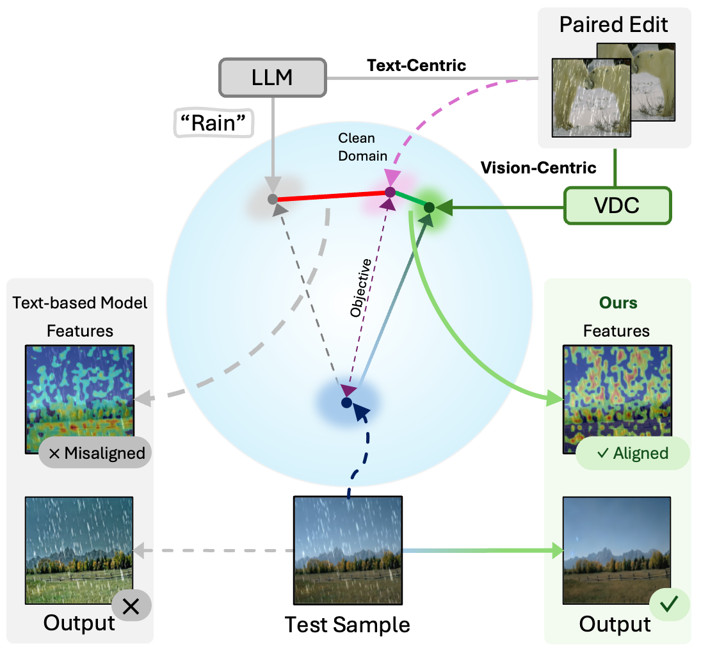
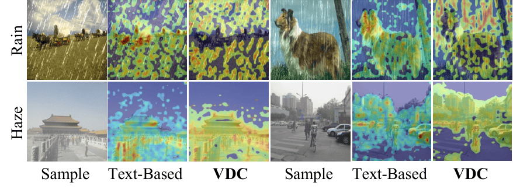
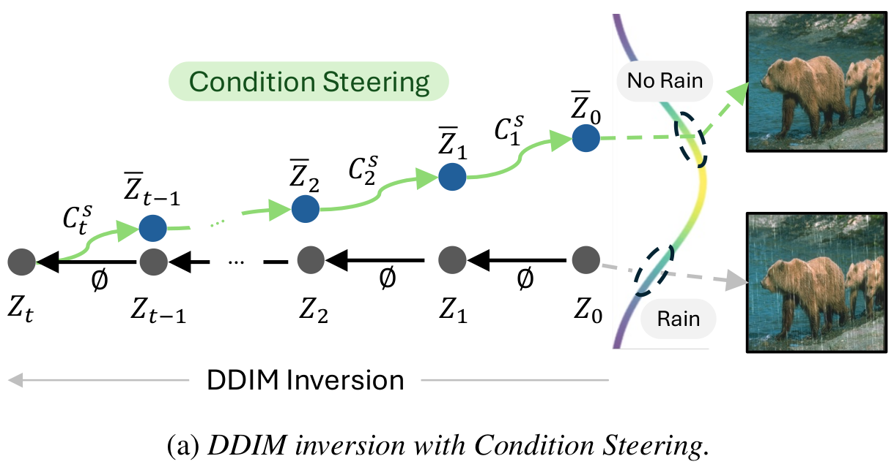
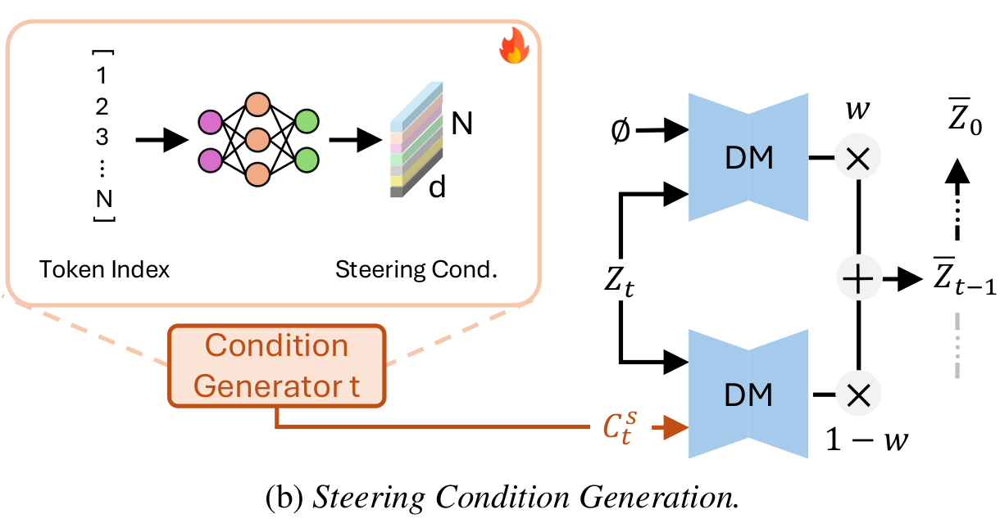
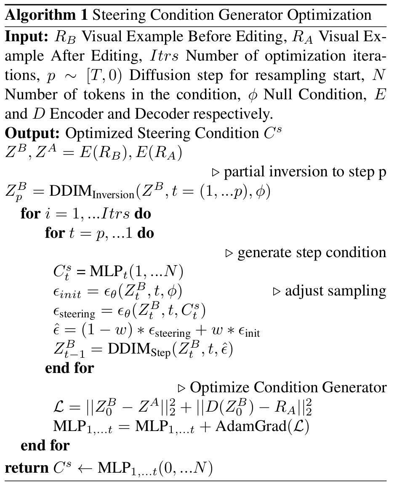
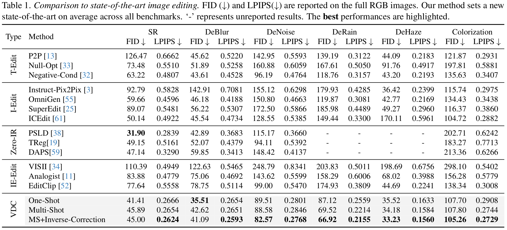
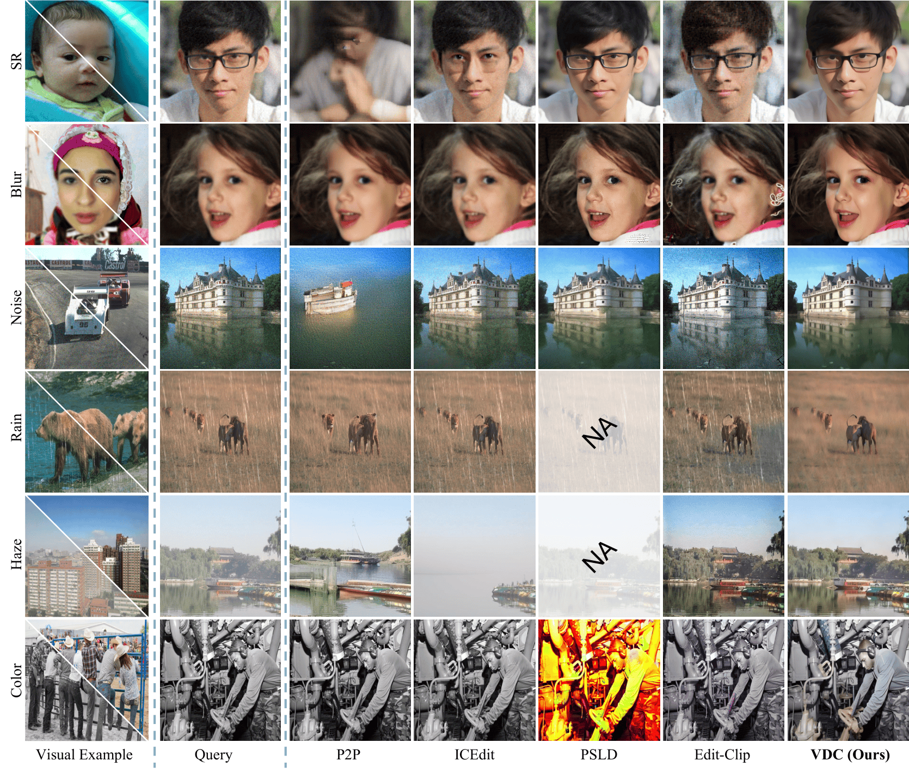
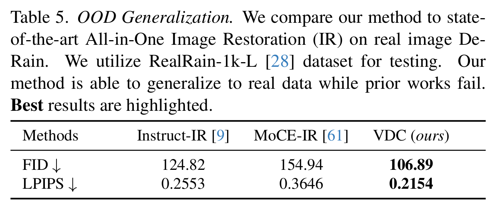
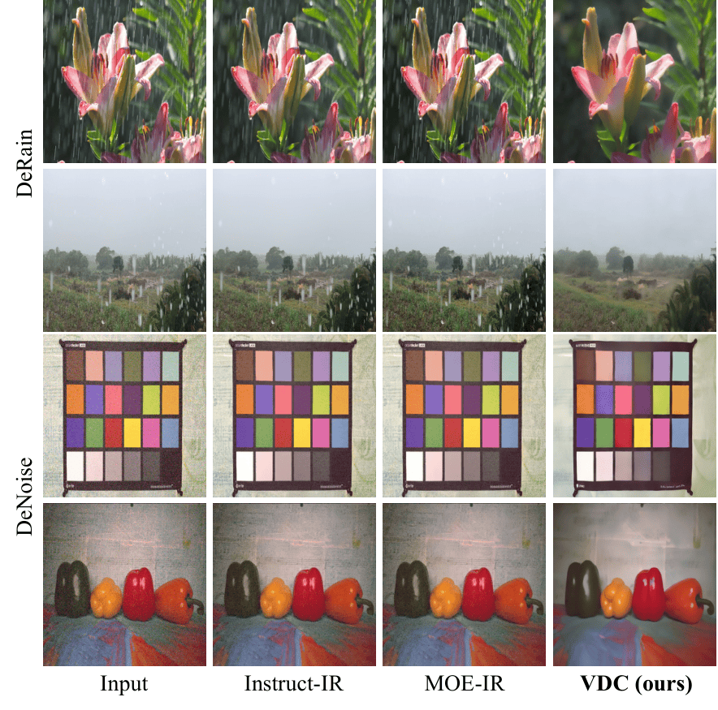

# Visual Diffusion Conditioning (VDC) - CVPR 2026


### Language-Free Generative Editing from One Visual Example

#### [Omar Elezabi](https://omaralezaby.github.io/), [Eduard Zamfir](https://eduardzamfir.github.io/), [Zongwei Wu](https://sites.google.com/view/zwwu/accueil), and [Radu Timofte](https://scholar.google.com/citations?user=u3MwH5kAAAAJ&hl=en&oi=sra)

#### **Computer Vision Lab, University of Würzburg, Germany**

[]()
[]()



## Latest
- `10/03/2026`: Full code release.
- `10/03/2026`: Paper Released on Arxiv
- `21/02/2026`: Our work got accepted at CVPR 2026!🎉

## Method
<details style="text-align: justify;">
  <summary>
  <font size="+1">Abstract</font>
  </summary>
<br>
Text-guided diffusion models have advanced image editing by enabling intuitive control through language.
However, despite their strong capabilities, we surprisingly find that SOTA methods struggle with simple, everyday transformations such as rain or blur. 
We attribute this limitation to weak and inconsistent textual supervision during training, which leads to poor alignment between language and vision. 
Existing solutions often rely on extra finetuning or stronger text conditioning, but suffer from high data and computational requirements. 
We contend that the capability for diffusion-based editing is not lost but merely hidden from text.
The door to cost-efficient visual editing remains open, and the key lies in a vision-centric paradigm that perceives and reasons about visual change as humans do, beyond words.
Inspired by this, we introduce <b>Visual Diffusion Conditioning</b> (VDC), a training-free framework that learns conditioning signals directly from visual examples for precise, language-free image editing.
Given a paired example—one image with and one without the target effect—VDC derives a visual condition that captures the transformation and steers generation through a novel condition-steering mechanism.
An accompanying inversion-correction step mitigates reconstruction errors during DDIM inversion, preserving fine detail and realism.
Across diverse tasks, VDC outperforms both training-free and fully fine-tuned text-based editing methods.

</details>


<details>
  <summary>
  <font size="+1"> Language-Vision misalignment.</font>
  </summary>
  <br>
  <div style="text-align: justify;">
  The internal representations of Stable-Diffusion fail to accurately capture the semantics of degradations such as “rain” or “haze”. Attention maps under text-based conditioning remain object-centric and do not correspond to degradation-specific visual attributes. Our VDC framework re-aligns attention focus toward true visual cues, recovering meaningful features that correspond to rain streaks and hazy regions.
  </div>
  <br>
  <p align="center">
  
  </p>
</details>


<details>
  <summary>
  <font size="+1"> Algorithm: Steering Condition Generator Optimization.</font>
  </summary>
  <br>
  <b>Proposed VDC framework.</b> 
  
  (a) Given a real image, we first invert it through DDIM and apply the learned steering condition $C_t^s$ to guide sampling toward the desired visual feature (e.g., removing rain) while preserving content and quality. 
  
  (b) A lightweight <b>Condition Generator</b> produces per-step steering embeddings from token indices, representing the target visual feature.
    These conditions modulate the diffusion outputs through weighted score blending, enabling training-free visual editing without textual prompts.
  <br>
  <div style=" clear: both; display: table;" >
  <div style="float: left; width: 48%; padding: 5px;">
    <div style=" clear: both; display: table;" >
    <div style="padding: 5px;">
    
    </div>
    <div style="padding: 5px;">
    
    </div>
    </div>

  </div>
  <div style="float: left; width: 48%; padding: 5px;">
    
  </div>
</div>
</details>


## Install
Download this repository
````
git clone https://github.com/omarAlezaby/VDC.git
cd VDC
````
Create a conda enviroment and install the dependencies:
````
conda create -n vdc python=3.10
conda activate vdc
pip install torch==2.4.0 torchvision==0.19.0 torchaudio==2.4.0 --index-url https://download.pytorch.org/whl/cu121
pip install -r requirements.txt
````

## Usage

### **Download required data and checkpoints**
Dowenload stable-diffusion checkpoint [`sd-v1-4.ckpt`](https://huggingface.co/CompVis/stable-diffusion-v-1-4-original/tree/main). Save the checkpoint in folder `models`

Dowenload clip model from [here](https://huggingface.co/openai/clip-vit-large-patch14/tree/main), and store it in folder `openai/clip-vit-large-patch14`.

You can dowenload the dataset used for our experiments and the optimized conditions from this [link](https://drive.google.com/drive/folders/12HkQN4hKoQWuSoV05BuIFlbtxw7zbESQ?usp=sharing).


### **Optimize steering condition (VDC) for a specific task**
#### **With Augmentation**
For a one-shot setup, augmentation is essential to provide enough variety for condition optimization. 
  `````
  bash optimize_vdc_aug.sh
  `````
#### **Without Augmentation**
When having multiple visual examples avoiding augmentation can speed the condition optimization.    
  `````
  bash optimize_vdc.sh
  `````

### **Inference**

#### **Without inversion correction**
After obtaining the optimized condition for a specific task (e.g., DeRain, DeBlur) you can use it to apply editing on different inputs without any inference overhead (similar time to base SD sampling).
`````
  bash inference_vdc.sh
`````
#### **With inversion correction**

You can enable our inversion correction module to correct DDIM-Inversion error for better content preservation. This module adds more inference time (20x).
`````
  bash inference_vdc_corrInver.sh
`````

## Results

<details>
  <summary>
  <font> Quantitative</font>
  </summary>
  <p align="center">
  
  </p>
</details>

<details>
  <summary>
  <font> Qualitative</font>
  </summary>
  <p align="center">
  
  </p>
</details>

<details>

<summary>
  <font> Real Data</font>
</summary>

<div style=" clear: both; display: table;" >
  <div style="float: left; width: 40%; padding: 5px;">
    
  </div>
  <div style="float: left; width: 50%; padding: 5px;">
    
  </div>
</div>

  
  <!-- <p align="center">
  
  </p> -->
</details>

## VDC with other T2I Diffusion Models
Our proposed method is a plug-and-play module that can be theoretically extended to any conditional diffusion model. Using VDC with other diffusion models only require simple modifications. 

As example we show how to add VDC to [SANA](https://github.com/NVlabs/Sana) diffusion model.

<ul>
  <li>First, Create a similar logic script as `scripts/Cond_Mapping.py` (e.g. DDIM Inversion, partial path sampling, etc).</li>
  <li>Second, Create the the condition optimization function.</li>
  <li>Third, apply condition steering by adjusting CFG equation.</li>
</ul>

You can find the code to integrate VDC in [SANA](https://github.com/NVlabs/Sana) in folder `SANA`


## Citation

If you find our work helpful, please consider citing the following paper and/or ⭐ the repo.
```

```


### Contacts

For any inquiries contact<br>
Omar Elezabi: <a href="mailto:omar.elezabi@uni-wuerzburg.de">omar.elezabi[at] uni-wuerzburg.de</a><br>

## Acknowledgements

The code is built on [stable-diffusion](https://github.com/CompVis/stable-diffusion).

## License

Copyright (c) 2025 Computer Vision Lab, University of Wurzburg

Licensed under CC BY-NC-SA 4.0 (Attribution-NonCommercial-ShareAlike 4.0 International); you may not use this file except in compliance with the License.
You may obtain a copy of the License at

https://creativecommons.org/licenses/by-nc-sa/4.0/legalcode

The code is released for academic research use only. For commercial use, please contact Computer Vision Lab, University of Würzburg.
Unless required by applicable law or agreed to in writing, software distributed under the License is distributed on an "AS IS" BASIS, WITHOUT WARRANTIES OR CONDITIONS OF ANY KIND, either express or implied.
See the License for the specific language governing permissions and limitations under the License.